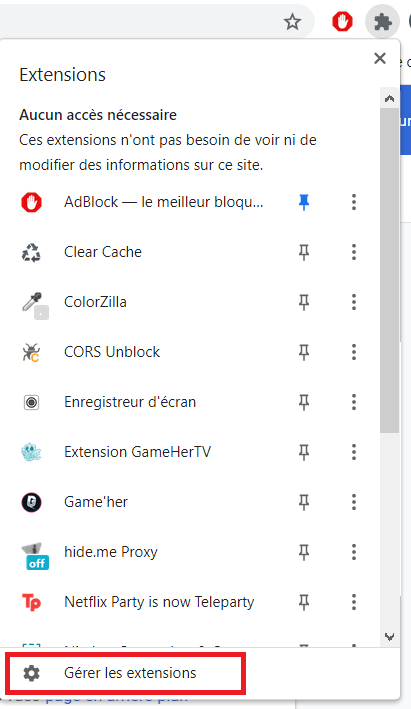

# Lancer l'extension en local

## Le mode développeur

Après avoir cloné le dossier Extension, lancer google chrome sur votre ordinateur.

Cliquer sur l'icône des extensions en haut a droite.

Appuyer ensuite sur "Gérer les extensions"

Il faudra alors activer le mode développeur et le bouton "Charger l'extension non empaquetée" devrait s'ajouter.
Cliquer dessus et sélectionner le dossier Extension précédemment cloné.

Et voila, l'extension peut être utilisée !
